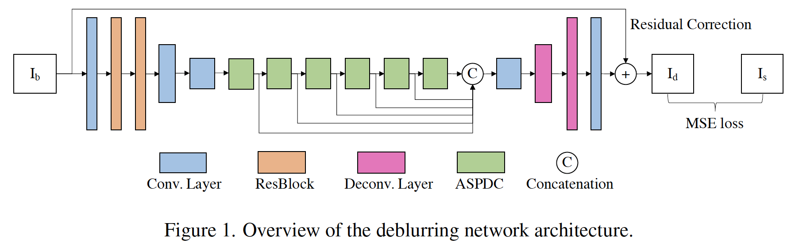
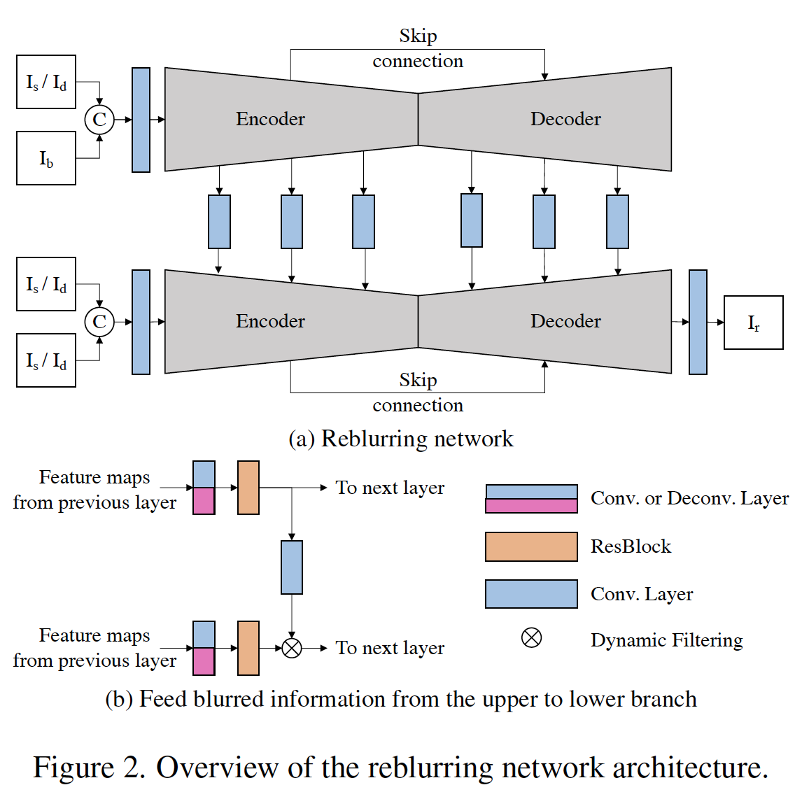
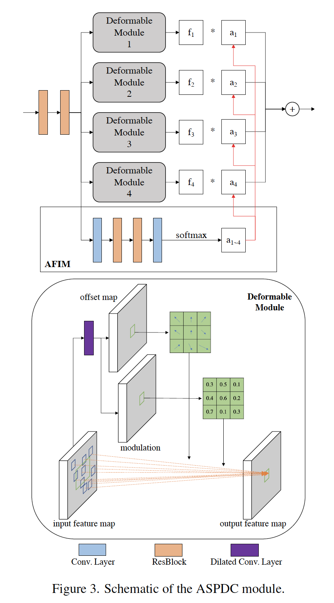
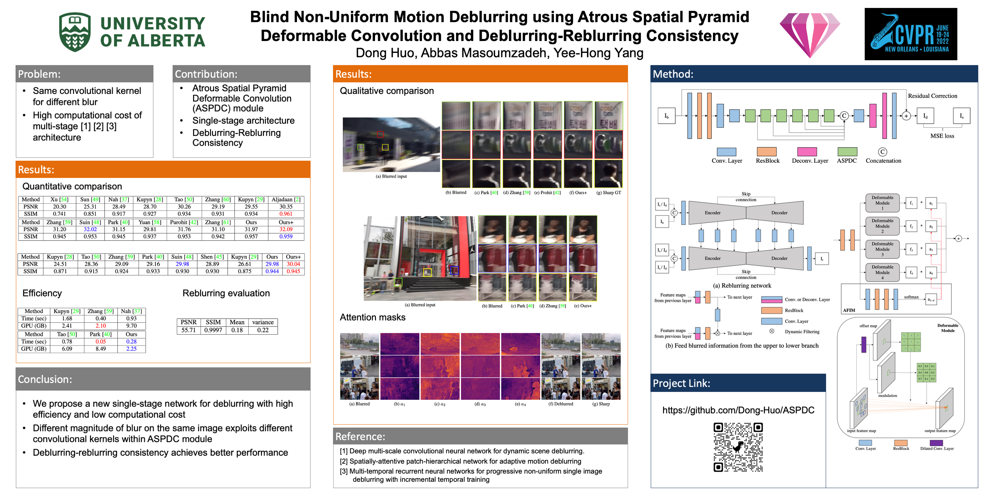

# Blind Non-Uniform Motion Deblurring using Atrous Spatial Pyramid Deformable Convolution and Deblurring-Reblurring Consistency

Code for this paper [Blind Non-Uniform Motion Deblurring using Atrous Spatial Pyramid Deformable Convolution and Deblurring-Reblurring Consistency]([https://arxiv.org/abs/2106.14336](https://openaccess.thecvf.com/content/CVPR2022W/NTIRE/html/Huo_Blind_Non-Uniform_Motion_Deblurring_Using_Atrous_Spatial_Pyramid_Deformable_Convolution_CVPRW_2022_paper.html))

[Dong Huo](https://scholar.google.com/citations?user=adUfxKkAAAAJ&hl=en), [Abbas Masoumzadeh](https://abbasmz.github.io/), [Yee-Hong Yang](http://webdocs.cs.ualberta.ca/~yang/)

## Overview

Many deep learning based methods are designed to remove non-uniform (spatially variant) motion blur caused by object motion and camera shake without knowing the blur kernel. Some methods directly output the latent sharp image in one stage, while others utilize a multi-stage strategy (\eg multi-scale, multi-patch, or multi-temporal) to gradually restore the sharp image. However, these methods have the following two main issues: 1) The computational cost of multi-stage is high; 2) The same convolution kernel is applied in different regions, which is not an ideal choice for non-uniform blur. Hence, non-uniform motion deblurring is still a challenging and open problem. In this paper, we propose a new architecture which consists of multiple Atrous Spatial Pyramid Deformable Convolution (ASPDC) modules to deblur an image end-to-end with more flexibility. Multiple ASPDC modules implicitly learn the pixel-specific motion with different dilation rates in the same layer to handle movements of different magnitude. To improve the training, we also propose a reblurring network to map the deblurred output back to the blurred input, which constrains the solution space. Our experimental results show that the proposed method outperforms state-of-the-art methods on the benchmark datasets.

## Architecture

<p align="center">
  
</p>

<p align="center">
  
</p>

<p align="center">
  
</p>


## Datasets

The datasets for training can be downloaded via the links below:
- [GoPro](https://drive.google.com/file/d/1KStHiZn5TNm2mo3OLZLjnRvd0vVFCI0W/view)
- [HIDE](https://www.dropbox.com/s/04w3wqxcuin9dy8/HIDE_dataset.zip?dl=0)
- [RWBI](https://drive.google.com/file/d/1fHkPiZOvLQSc4HhT8-wA6dh0M4skpTMi/view)

## Prerequisites
- Python 3.8 
- PyTorch 1.9.0
- mmcv-full 1.3.9
- Requirements: opencv-python, albumentations
- Platforms: Ubuntu 20.04, RTX 2080 Ti, cuda-11.1

## Training

```python DR_training.py```

Modify the arguments in parse_args()


## Testing

```python D_testing.py```
Download the well-trained [models](https://drive.google.com/file/d/14He_BWFMDDSaUjSHlZgxaN72EPpvxpCe/view) in folder /final_model 
- ReBlurringNet.pth: the model of reblurring network
- DeblurringNet_NF.pth: the model of deblurring network without fine-tuning
- DeblurringNet_NF.pth: the model of deblurring network fine-tuned with reblurring loss

Baidu netdisk users can also download the model from [link](https://pan.baidu.com/s/1sGuaSG-5VAzZ5AQ8ANkL5w)  with password: tkc9


## Citation

If you use this code for your research, please cite our paper.

```

@InProceedings{Huo_2022_CVPR,
    author    = {Huo, Dong and Masoumzadeh, Abbas and Yang, Yee-Hong},
    title     = {Blind Non-Uniform Motion Deblurring Using Atrous Spatial Pyramid Deformable Convolution and Deblurring-Reblurring Consistency},
    booktitle = {Proceedings of the IEEE/CVF Conference on Computer Vision and Pattern Recognition (CVPR) Workshops},
    month     = {June},
    year      = {2022},
    pages     = {437-446}
}

```

## Poster

<p align="center">
  
</p>

